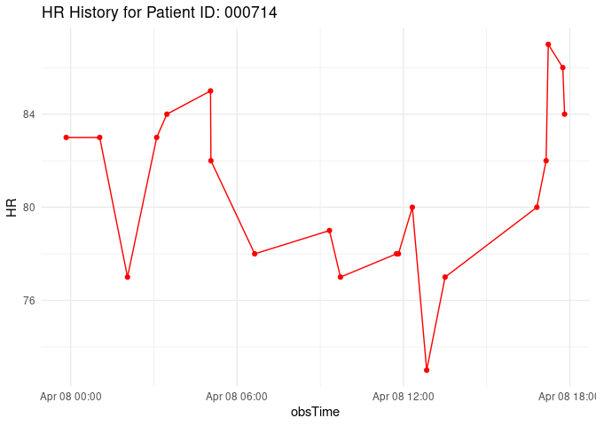
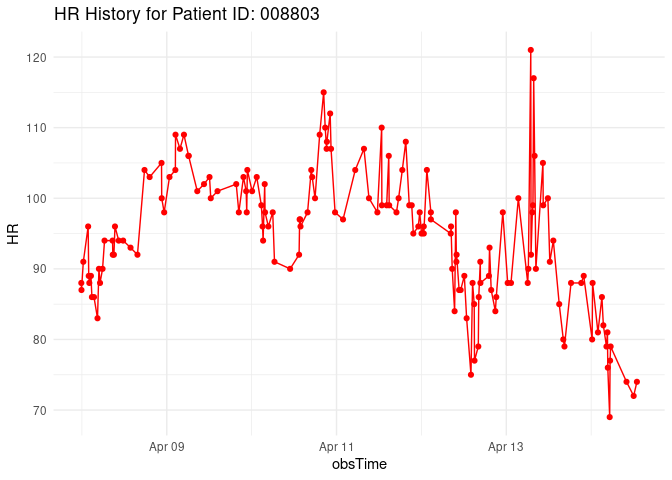
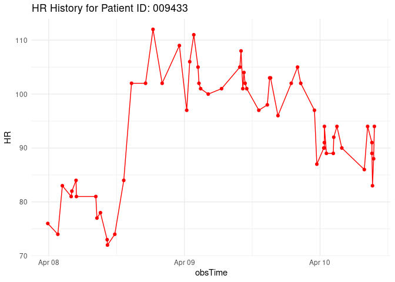

Sepsis Assignment
================

## Task 2

- Fread is faster than read_delim and it takes longer to read in data
  the more observations that you are reading in

## Task 4

#### The date and time of the report

    Hello! The last time the report was run: 2023-04-09 14:12:03

#### Recent heart rate, temperature, and respiratory rate for patients who currently have sepsis

``` r
if(nrow(septic_data) >=1){
table1 <- most_recent_data %>%
  filter(SepsisLabel == 1) %>%
  select(c(PatientID, HR, Temp, Resp, obsTime)) %>%
  ungroup() %>%
  gt() %>%
  cols_label(Temp = "Temperature",
             HR = "Heart Rate",
             Resp = "Respiration",
             obsTime = "Last Update") %>%
  tab_header(title = "Most recent vital signs for Septic Patients")

table1
} else{
  print("Hooray, no septic patients to report")
}
```

<div id="ixjcydibdq" style="padding-left:0px;padding-right:0px;padding-top:10px;padding-bottom:10px;overflow-x:auto;overflow-y:auto;width:auto;height:auto;">
<style>#ixjcydibdq table {
  font-family: system-ui, 'Segoe UI', Roboto, Helvetica, Arial, sans-serif, 'Apple Color Emoji', 'Segoe UI Emoji', 'Segoe UI Symbol', 'Noto Color Emoji';
  -webkit-font-smoothing: antialiased;
  -moz-osx-font-smoothing: grayscale;
}

#ixjcydibdq thead, #ixjcydibdq tbody, #ixjcydibdq tfoot, #ixjcydibdq tr, #ixjcydibdq td, #ixjcydibdq th {
  border-style: none;
}

#ixjcydibdq p {
  margin: 0;
  padding: 0;
}

#ixjcydibdq .gt_table {
  display: table;
  border-collapse: collapse;
  line-height: normal;
  margin-left: auto;
  margin-right: auto;
  color: #333333;
  font-size: 16px;
  font-weight: normal;
  font-style: normal;
  background-color: #FFFFFF;
  width: auto;
  border-top-style: solid;
  border-top-width: 2px;
  border-top-color: #A8A8A8;
  border-right-style: none;
  border-right-width: 2px;
  border-right-color: #D3D3D3;
  border-bottom-style: solid;
  border-bottom-width: 2px;
  border-bottom-color: #A8A8A8;
  border-left-style: none;
  border-left-width: 2px;
  border-left-color: #D3D3D3;
}

#ixjcydibdq .gt_caption {
  padding-top: 4px;
  padding-bottom: 4px;
}

#ixjcydibdq .gt_title {
  color: #333333;
  font-size: 125%;
  font-weight: initial;
  padding-top: 4px;
  padding-bottom: 4px;
  padding-left: 5px;
  padding-right: 5px;
  border-bottom-color: #FFFFFF;
  border-bottom-width: 0;
}

#ixjcydibdq .gt_subtitle {
  color: #333333;
  font-size: 85%;
  font-weight: initial;
  padding-top: 3px;
  padding-bottom: 5px;
  padding-left: 5px;
  padding-right: 5px;
  border-top-color: #FFFFFF;
  border-top-width: 0;
}

#ixjcydibdq .gt_heading {
  background-color: #FFFFFF;
  text-align: center;
  border-bottom-color: #FFFFFF;
  border-left-style: none;
  border-left-width: 1px;
  border-left-color: #D3D3D3;
  border-right-style: none;
  border-right-width: 1px;
  border-right-color: #D3D3D3;
}

#ixjcydibdq .gt_bottom_border {
  border-bottom-style: solid;
  border-bottom-width: 2px;
  border-bottom-color: #D3D3D3;
}

#ixjcydibdq .gt_col_headings {
  border-top-style: solid;
  border-top-width: 2px;
  border-top-color: #D3D3D3;
  border-bottom-style: solid;
  border-bottom-width: 2px;
  border-bottom-color: #D3D3D3;
  border-left-style: none;
  border-left-width: 1px;
  border-left-color: #D3D3D3;
  border-right-style: none;
  border-right-width: 1px;
  border-right-color: #D3D3D3;
}

#ixjcydibdq .gt_col_heading {
  color: #333333;
  background-color: #FFFFFF;
  font-size: 100%;
  font-weight: normal;
  text-transform: inherit;
  border-left-style: none;
  border-left-width: 1px;
  border-left-color: #D3D3D3;
  border-right-style: none;
  border-right-width: 1px;
  border-right-color: #D3D3D3;
  vertical-align: bottom;
  padding-top: 5px;
  padding-bottom: 6px;
  padding-left: 5px;
  padding-right: 5px;
  overflow-x: hidden;
}

#ixjcydibdq .gt_column_spanner_outer {
  color: #333333;
  background-color: #FFFFFF;
  font-size: 100%;
  font-weight: normal;
  text-transform: inherit;
  padding-top: 0;
  padding-bottom: 0;
  padding-left: 4px;
  padding-right: 4px;
}

#ixjcydibdq .gt_column_spanner_outer:first-child {
  padding-left: 0;
}

#ixjcydibdq .gt_column_spanner_outer:last-child {
  padding-right: 0;
}

#ixjcydibdq .gt_column_spanner {
  border-bottom-style: solid;
  border-bottom-width: 2px;
  border-bottom-color: #D3D3D3;
  vertical-align: bottom;
  padding-top: 5px;
  padding-bottom: 5px;
  overflow-x: hidden;
  display: inline-block;
  width: 100%;
}

#ixjcydibdq .gt_spanner_row {
  border-bottom-style: hidden;
}

#ixjcydibdq .gt_group_heading {
  padding-top: 8px;
  padding-bottom: 8px;
  padding-left: 5px;
  padding-right: 5px;
  color: #333333;
  background-color: #FFFFFF;
  font-size: 100%;
  font-weight: initial;
  text-transform: inherit;
  border-top-style: solid;
  border-top-width: 2px;
  border-top-color: #D3D3D3;
  border-bottom-style: solid;
  border-bottom-width: 2px;
  border-bottom-color: #D3D3D3;
  border-left-style: none;
  border-left-width: 1px;
  border-left-color: #D3D3D3;
  border-right-style: none;
  border-right-width: 1px;
  border-right-color: #D3D3D3;
  vertical-align: middle;
  text-align: left;
}

#ixjcydibdq .gt_empty_group_heading {
  padding: 0.5px;
  color: #333333;
  background-color: #FFFFFF;
  font-size: 100%;
  font-weight: initial;
  border-top-style: solid;
  border-top-width: 2px;
  border-top-color: #D3D3D3;
  border-bottom-style: solid;
  border-bottom-width: 2px;
  border-bottom-color: #D3D3D3;
  vertical-align: middle;
}

#ixjcydibdq .gt_from_md > :first-child {
  margin-top: 0;
}

#ixjcydibdq .gt_from_md > :last-child {
  margin-bottom: 0;
}

#ixjcydibdq .gt_row {
  padding-top: 8px;
  padding-bottom: 8px;
  padding-left: 5px;
  padding-right: 5px;
  margin: 10px;
  border-top-style: solid;
  border-top-width: 1px;
  border-top-color: #D3D3D3;
  border-left-style: none;
  border-left-width: 1px;
  border-left-color: #D3D3D3;
  border-right-style: none;
  border-right-width: 1px;
  border-right-color: #D3D3D3;
  vertical-align: middle;
  overflow-x: hidden;
}

#ixjcydibdq .gt_stub {
  color: #333333;
  background-color: #FFFFFF;
  font-size: 100%;
  font-weight: initial;
  text-transform: inherit;
  border-right-style: solid;
  border-right-width: 2px;
  border-right-color: #D3D3D3;
  padding-left: 5px;
  padding-right: 5px;
}

#ixjcydibdq .gt_stub_row_group {
  color: #333333;
  background-color: #FFFFFF;
  font-size: 100%;
  font-weight: initial;
  text-transform: inherit;
  border-right-style: solid;
  border-right-width: 2px;
  border-right-color: #D3D3D3;
  padding-left: 5px;
  padding-right: 5px;
  vertical-align: top;
}

#ixjcydibdq .gt_row_group_first td {
  border-top-width: 2px;
}

#ixjcydibdq .gt_row_group_first th {
  border-top-width: 2px;
}

#ixjcydibdq .gt_summary_row {
  color: #333333;
  background-color: #FFFFFF;
  text-transform: inherit;
  padding-top: 8px;
  padding-bottom: 8px;
  padding-left: 5px;
  padding-right: 5px;
}

#ixjcydibdq .gt_first_summary_row {
  border-top-style: solid;
  border-top-color: #D3D3D3;
}

#ixjcydibdq .gt_first_summary_row.thick {
  border-top-width: 2px;
}

#ixjcydibdq .gt_last_summary_row {
  padding-top: 8px;
  padding-bottom: 8px;
  padding-left: 5px;
  padding-right: 5px;
  border-bottom-style: solid;
  border-bottom-width: 2px;
  border-bottom-color: #D3D3D3;
}

#ixjcydibdq .gt_grand_summary_row {
  color: #333333;
  background-color: #FFFFFF;
  text-transform: inherit;
  padding-top: 8px;
  padding-bottom: 8px;
  padding-left: 5px;
  padding-right: 5px;
}

#ixjcydibdq .gt_first_grand_summary_row {
  padding-top: 8px;
  padding-bottom: 8px;
  padding-left: 5px;
  padding-right: 5px;
  border-top-style: double;
  border-top-width: 6px;
  border-top-color: #D3D3D3;
}

#ixjcydibdq .gt_last_grand_summary_row_top {
  padding-top: 8px;
  padding-bottom: 8px;
  padding-left: 5px;
  padding-right: 5px;
  border-bottom-style: double;
  border-bottom-width: 6px;
  border-bottom-color: #D3D3D3;
}

#ixjcydibdq .gt_striped {
  background-color: rgba(128, 128, 128, 0.05);
}

#ixjcydibdq .gt_table_body {
  border-top-style: solid;
  border-top-width: 2px;
  border-top-color: #D3D3D3;
  border-bottom-style: solid;
  border-bottom-width: 2px;
  border-bottom-color: #D3D3D3;
}

#ixjcydibdq .gt_footnotes {
  color: #333333;
  background-color: #FFFFFF;
  border-bottom-style: none;
  border-bottom-width: 2px;
  border-bottom-color: #D3D3D3;
  border-left-style: none;
  border-left-width: 2px;
  border-left-color: #D3D3D3;
  border-right-style: none;
  border-right-width: 2px;
  border-right-color: #D3D3D3;
}

#ixjcydibdq .gt_footnote {
  margin: 0px;
  font-size: 90%;
  padding-top: 4px;
  padding-bottom: 4px;
  padding-left: 5px;
  padding-right: 5px;
}

#ixjcydibdq .gt_sourcenotes {
  color: #333333;
  background-color: #FFFFFF;
  border-bottom-style: none;
  border-bottom-width: 2px;
  border-bottom-color: #D3D3D3;
  border-left-style: none;
  border-left-width: 2px;
  border-left-color: #D3D3D3;
  border-right-style: none;
  border-right-width: 2px;
  border-right-color: #D3D3D3;
}

#ixjcydibdq .gt_sourcenote {
  font-size: 90%;
  padding-top: 4px;
  padding-bottom: 4px;
  padding-left: 5px;
  padding-right: 5px;
}

#ixjcydibdq .gt_left {
  text-align: left;
}

#ixjcydibdq .gt_center {
  text-align: center;
}

#ixjcydibdq .gt_right {
  text-align: right;
  font-variant-numeric: tabular-nums;
}

#ixjcydibdq .gt_font_normal {
  font-weight: normal;
}

#ixjcydibdq .gt_font_bold {
  font-weight: bold;
}

#ixjcydibdq .gt_font_italic {
  font-style: italic;
}

#ixjcydibdq .gt_super {
  font-size: 65%;
}

#ixjcydibdq .gt_footnote_marks {
  font-size: 75%;
  vertical-align: 0.4em;
  position: initial;
}

#ixjcydibdq .gt_asterisk {
  font-size: 100%;
  vertical-align: 0;
}

#ixjcydibdq .gt_indent_1 {
  text-indent: 5px;
}

#ixjcydibdq .gt_indent_2 {
  text-indent: 10px;
}

#ixjcydibdq .gt_indent_3 {
  text-indent: 15px;
}

#ixjcydibdq .gt_indent_4 {
  text-indent: 20px;
}

#ixjcydibdq .gt_indent_5 {
  text-indent: 25px;
}
</style>
<table class="gt_table" data-quarto-disable-processing="false" data-quarto-bootstrap="false">
  <thead>
    <tr class="gt_heading">
      <td colspan="5" class="gt_heading gt_title gt_font_normal gt_bottom_border" style>Most recent vital signs for Septic Patients</td>
    </tr>
    
    <tr class="gt_col_headings">
      <th class="gt_col_heading gt_columns_bottom_border gt_right" rowspan="1" colspan="1" scope="col" id="PatientID">PatientID</th>
      <th class="gt_col_heading gt_columns_bottom_border gt_right" rowspan="1" colspan="1" scope="col" id="Heart Rate">Heart Rate</th>
      <th class="gt_col_heading gt_columns_bottom_border gt_right" rowspan="1" colspan="1" scope="col" id="Temperature">Temperature</th>
      <th class="gt_col_heading gt_columns_bottom_border gt_right" rowspan="1" colspan="1" scope="col" id="Respiration">Respiration</th>
      <th class="gt_col_heading gt_columns_bottom_border gt_right" rowspan="1" colspan="1" scope="col" id="Last Update">Last Update</th>
    </tr>
  </thead>
  <tbody class="gt_table_body">
    <tr><td headers="PatientID" class="gt_row gt_right">000714</td>
<td headers="HR" class="gt_row gt_right">84</td>
<td headers="Temp" class="gt_row gt_right">NA</td>
<td headers="Resp" class="gt_row gt_right">19</td>
<td headers="obsTime" class="gt_row gt_right">2023-04-08 17:48:46</td></tr>
    <tr><td headers="PatientID" class="gt_row gt_right">001948</td>
<td headers="HR" class="gt_row gt_right">84</td>
<td headers="Temp" class="gt_row gt_right">NA</td>
<td headers="Resp" class="gt_row gt_right">25</td>
<td headers="obsTime" class="gt_row gt_right">2023-04-08 22:43:12</td></tr>
  </tbody>
  
  
</table>
</div>

#### Plots for all patients who have sepsis that show the complete history of their heart rate, temperature, and respiratory rate during their time in the ICU.

``` r
filtered_sepsis <- new_data %>%
group_by(PatientID) %>%
  mutate(any_sepsis = ifelse(any(SepsisLabel == 1), 1, 0)) %>%
  filter(any_sepsis == 1) 


patient_ids <- unique(filtered_sepsis$PatientID)
if(nrow(filtered_sepsis)>=1) {
  
for (i in patient_ids) {
  patient_data <- filtered_sepsis %>% filter(PatientID == i)
  
  if (nrow(patient_data) > 0) {
    p <-ggplot(patient_data, aes(x = obsTime, y = HR)) +
      geom_point(color = "red") +
      geom_line(color= "red") + 
      ggtitle(paste("HR History for Patient ID:", i)) +
      theme_minimal()
    
    print(p)
  }
} 

for (i in patient_ids) {
  patient_data <- filtered_sepsis %>% filter(PatientID == i)
  
  if (nrow(patient_data) > 0) {
    t <-ggplot(patient_data, aes(x = obsTime, y = Temp)) +
      geom_point(color = "darkgreen") +
      geom_line(color= "darkgreen") + 
      ggtitle(paste("Temp History for Patient ID:", i)) +
      theme_minimal()
    
    print(t)
  }
}

for (i in patient_ids) {
  patient_data <- filtered_sepsis %>% filter(PatientID == i)
if(nrow(patient_data) >0){
    r <-ggplot(patient_data, aes(x=obsTime, y= Resp)) +
      geom_point(color= "lightblue") +
      geom_line(color = "lightblue") +
      ggtitle(paste("Resp History for Patient ID:", i)) +
      theme_minimal()
    print(r)
  }
}
} else{
  print("Hooray, no septic patients to graph")
}
```









#### A table showing the change in heart rate, temperature, and respiratory rate between the last two measurements for all patients

``` r
new_data %>%
  group_by(PatientID) %>%
  arrange(obsTime, .by_group = TRUE, desc=TRUE) %>%
  slice_max(n=2, order_by=obsTime) %>%
mutate(prev_HR = lag(HR, order_by = obsTime),
         HR_change = (HR- prev_HR),
         prev_resp = lag(Resp, order_by = obsTime),
         Resp_change = (Resp - prev_resp),
         prev_temp = lag(Temp, order_by = obsTime),
         temp_change = (Temp - prev_temp)) %>%
  select(PatientID, HR_change, temp_change, Resp_change) %>%
  ungroup() %>%
  knitr::kable()
```

| PatientID | HR_change | temp_change | Resp_change |
|:----------|----------:|------------:|------------:|
| 000003    |        -2 |          NA |           6 |
| 000003    |        NA |          NA |          NA |
| 000052    |         4 |          NA |           2 |
| 000052    |        NA |          NA |          NA |
| 000054    |       -10 |          NA |          -6 |
| 000054    |        NA |          NA |          NA |
| 000057    |         7 |          NA |           2 |
| 000057    |        NA |          NA |          NA |
| 000122    |        -3 |          NA |          -4 |
| 000122    |        NA |          NA |          NA |
| 000180    |         3 |          NA |           1 |
| 000180    |        NA |          NA |          NA |
| 000315    |         0 |          NA |          14 |
| 000315    |        NA |          NA |          NA |
| 000388    |         6 |          NA |           1 |
| 000388    |        NA |          NA |          NA |
| 000714    |        -2 |          NA |          -1 |
| 000714    |        NA |          NA |          NA |
| 001000    |        -2 |        0.00 |          NA |
| 001000    |        NA |          NA |          NA |
| 001258    |         3 |          NA |           0 |
| 001258    |        NA |          NA |          NA |
| 001262    |        -5 |          NA |           3 |
| 001262    |        NA |          NA |          NA |
| 001286    |        NA |          NA |          NA |
| 001286    |        NA |          NA |          NA |
| 001759    |         2 |          NA |           4 |
| 001759    |        NA |          NA |          NA |
| 001948    |        -6 |          NA |          -5 |
| 001948    |        NA |          NA |          NA |
| 002017    |         1 |          NA |           4 |
| 002017    |        NA |          NA |          NA |
| 002077    |         3 |          NA |          -2 |
| 002077    |        NA |          NA |          NA |
| 002467    |        NA |          NA |          NA |
| 002467    |        NA |          NA |          NA |
| 002516    |        NA |          NA |          NA |
| 002516    |        NA |          NA |          NA |
| 002699    |         3 |          NA |           1 |
| 002699    |        NA |          NA |          NA |
| 002719    |         0 |          NA |          -2 |
| 002719    |        NA |          NA |          NA |
| 003342    |         1 |          NA |           0 |
| 003342    |        NA |          NA |          NA |
| 003364    |        -1 |          NA |           2 |
| 003364    |        NA |          NA |          NA |
| 003404    |        NA |          NA |          NA |
| 003404    |        NA |          NA |          NA |
| 003751    |       -18 |          NA |          -6 |
| 003751    |        NA |          NA |          NA |
| 003797    |        -4 |          NA |          -3 |
| 003797    |        NA |          NA |          NA |
| 004370    |        -3 |          NA |           7 |
| 004370    |        NA |          NA |          NA |
| 004842    |        NA |          NA |          NA |
| 004842    |        NA |          NA |          NA |
| 005042    |        NA |          NA |          NA |
| 005042    |        NA |          NA |          NA |
| 005496    |         9 |        0.00 |          -7 |
| 005496    |        NA |          NA |          NA |
| 006095    |         0 |          NA |           0 |
| 006095    |        NA |          NA |          NA |
| 006455    |        NA |          NA |          NA |
| 006455    |        NA |          NA |          NA |
| 006767    |        -3 |          NA |          -6 |
| 006767    |        NA |          NA |          NA |
| 006936    |        -6 |          NA |          NA |
| 006936    |        NA |          NA |          NA |
| 008226    |        -2 |       -0.17 |          -1 |
| 008226    |        NA |          NA |          NA |
| 008268    |        17 |       -0.50 |          11 |
| 008268    |        NA |          NA |          NA |
| 008524    |         6 |          NA |           1 |
| 008524    |        NA |          NA |          NA |
| 008536    |        NA |          NA |          NA |
| 008536    |        NA |          NA |          NA |
| 008574    |         0 |          NA |           0 |
| 008574    |        NA |          NA |          NA |
| 008614    |        -1 |          NA |           3 |
| 008614    |        NA |          NA |          NA |
| 008803    |        -3 |          NA |           0 |
| 008803    |        NA |          NA |          NA |
| 008882    |        -2 |          NA |           1 |
| 008882    |        NA |          NA |          NA |
| 009312    |        -6 |          NA |           6 |
| 009312    |        NA |          NA |          NA |
| 009429    |        NA |          NA |          NA |
| 009429    |        NA |          NA |          NA |
| 009433    |        -4 |          NA |           0 |
| 009433    |        NA |          NA |          NA |
| 009454    |         1 |          NA |           1 |
| 009454    |        NA |          NA |          NA |
| 009511    |         1 |          NA |           4 |
| 009511    |        NA |          NA |          NA |
| 009657    |        -3 |          NA |          -1 |
| 009657    |        NA |          NA |          NA |
| 009814    |        14 |          NA |           0 |
| 009814    |        NA |          NA |          NA |
| 009982    |        -5 |          NA |           0 |
| 009982    |        NA |          NA |          NA |
