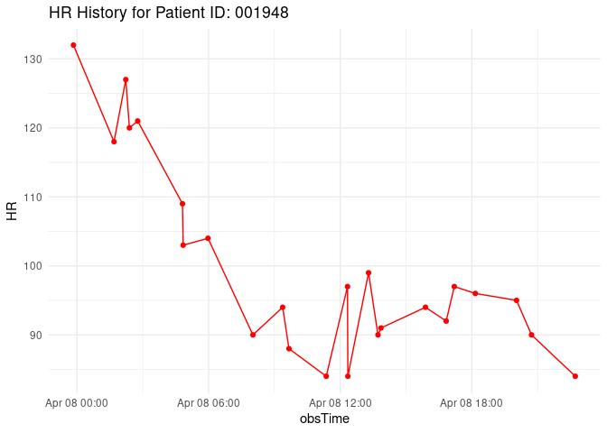
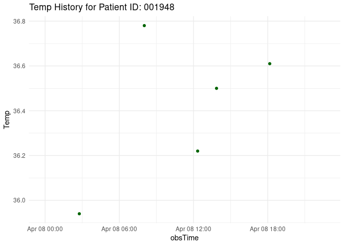
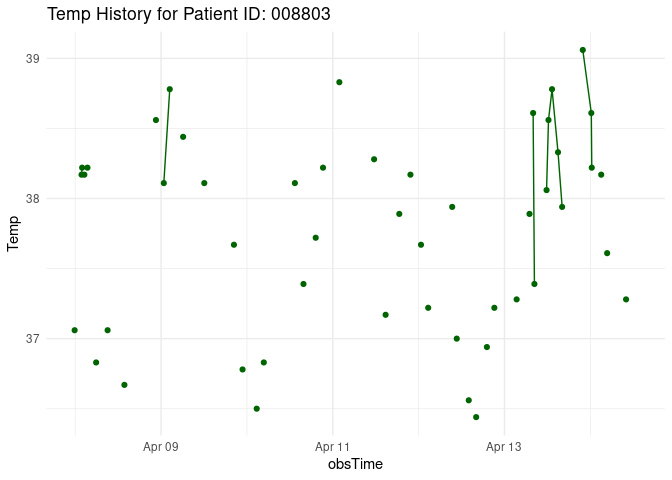
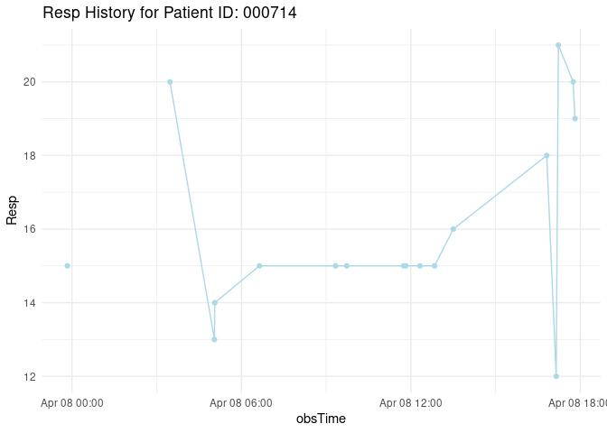
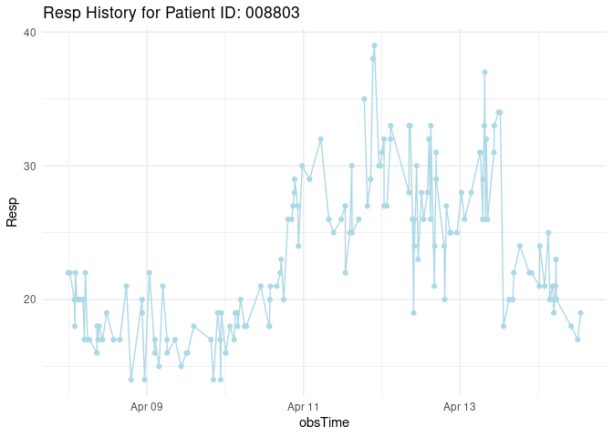

# Sepsis Assignment

## Task 2

- Fread is faster than read_delim and it takes longer to read in data
  the more observations that you are reading in

## Task 4

#### The date and time of the report

    Hello! The last time the report was run: 2023-08-20 05:12:42

#### Recent heart rate, temperature, and respiratory rate for patients who currently have sepsis

``` r
if(nrow(septic_data) >=1){
table1 <- most_recent_data %>%
  filter(SepsisLabel == 1) %>%
  select(c(PatientID, HR, Temp, Resp, obsTime)) %>%
  ungroup() %>%
  knitr::kable(col.name = c("Patient_ID", "Heart_Rate", "Temp", "Respiration", "Obs_time"))

table1
} else{
  print("Hooray, no septic patients to report")
}
```

| Patient_ID | Heart_Rate |  Temp | Respiration | Obs_time            |
|:-----------|-----------:|------:|------------:|:--------------------|
| 000714     |         84 |    NA |          19 | 2023-04-08 17:48:46 |
| 001948     |         84 |    NA |          25 | 2023-04-08 22:43:12 |
| 008803     |         74 |    NA |          19 | 2023-04-14 12:55:54 |
| 009433     |         94 | 38.44 |          34 | 2023-04-10 09:36:59 |

#### Plots for all patients who have sepsis that show the complete history of their heart rate, temperature, and respiratory rate during their time in the ICU.

``` r
filtered_sepsis <- new_data %>%
group_by(PatientID) %>%
  mutate(any_sepsis = ifelse(any(SepsisLabel == 1), 1, 0)) %>%
  filter(any_sepsis == 1) 


patient_ids <- unique(filtered_sepsis$PatientID)
if(nrow(filtered_sepsis)>=1) {
  
for (i in patient_ids) {
  patient_data <- filtered_sepsis %>% filter(PatientID == i)
  
  if (nrow(patient_data) > 0) {
    p <-ggplot(patient_data, aes(x = obsTime, y = HR)) +
      geom_point(color = "red") +
      geom_line(color= "red") + 
      ggtitle(paste("HR History for Patient ID:", i)) +
      theme_minimal()
    
    print(p)
  }
} 

for (i in patient_ids) {
  patient_data <- filtered_sepsis %>% filter(PatientID == i)
  
  if (nrow(patient_data) > 0) {
    t <-ggplot(patient_data, aes(x = obsTime, y = Temp)) +
      geom_point(color = "darkgreen") +
      geom_line(color= "darkgreen") + 
      ggtitle(paste("Temp History for Patient ID:", i)) +
      theme_minimal()
    
    print(t)
  }
}

for (i in patient_ids) {
  patient_data <- filtered_sepsis %>% filter(PatientID == i)
if(nrow(patient_data) >0){
    r <-ggplot(patient_data, aes(x=obsTime, y= Resp)) +
      geom_point(color= "lightblue") +
      geom_line(color = "lightblue") +
      ggtitle(paste("Resp History for Patient ID:", i)) +
      theme_minimal()
    print(r)
  }
}
} else{
  print("Hooray, no septic patients to graph")
}
```
















#### A table showing the change in heart rate, temperature, and respiratory rate between the last two measurements for all patients

``` r
new_data %>%
  group_by(PatientID) %>%
  arrange(obsTime, .by_group = TRUE, desc=TRUE) %>%
  slice_max(n=2, order_by=obsTime) %>%
mutate(prev_HR = lag(HR, order_by = obsTime),
         HR_change = (HR- prev_HR),
         prev_resp = lag(Resp, order_by = obsTime),
         Resp_change = (Resp - prev_resp),
         prev_temp = lag(Temp, order_by = obsTime),
         temp_change = (Temp - prev_temp)) %>%
  select(PatientID, HR_change, temp_change, Resp_change) %>%
  ungroup() %>%
  knitr::kable()
```

| PatientID | HR_change | temp_change | Resp_change |
|:----------|----------:|------------:|------------:|
| 000003    |         2 |          NA |          -1 |
| 000003    |        NA |          NA |          NA |
| 000052    |        -1 |          NA |          -1 |
| 000052    |        NA |          NA |          NA |
| 000054    |       -14 |          NA |          -1 |
| 000054    |        NA |          NA |          NA |
| 000057    |         7 |          NA |           2 |
| 000057    |        NA |          NA |          NA |
| 000122    |        -3 |          NA |          -4 |
| 000122    |        NA |          NA |          NA |
| 000180    |         3 |          NA |           1 |
| 000180    |        NA |          NA |          NA |
| 000315    |         9 |          NA |          -6 |
| 000315    |        NA |          NA |          NA |
| 000388    |         6 |          NA |           1 |
| 000388    |        NA |          NA |          NA |
| 000714    |        -2 |          NA |          -1 |
| 000714    |        NA |          NA |          NA |
| 001000    |        -2 |        0.00 |          NA |
| 001000    |        NA |          NA |          NA |
| 001258    |        -4 |          NA |           1 |
| 001258    |        NA |          NA |          NA |
| 001262    |        -3 |          NA |          -5 |
| 001262    |        NA |          NA |          NA |
| 001286    |        NA |          NA |          NA |
| 001286    |        NA |          NA |          NA |
| 001759    |        -2 |          NA |           2 |
| 001759    |        NA |          NA |          NA |
| 001948    |        -6 |          NA |          -5 |
| 001948    |        NA |          NA |          NA |
| 002017    |         1 |          NA |           4 |
| 002017    |        NA |          NA |          NA |
| 002077    |         6 |          NA |          -4 |
| 002077    |        NA |          NA |          NA |
| 002467    |        -1 |       -0.10 |          -2 |
| 002467    |        NA |          NA |          NA |
| 002516    |        NA |          NA |          NA |
| 002516    |        NA |          NA |          NA |
| 002699    |         3 |          NA |           1 |
| 002699    |        NA |          NA |          NA |
| 002719    |        -9 |          NA |          -2 |
| 002719    |        NA |          NA |          NA |
| 003342    |         1 |        0.00 |           1 |
| 003342    |        NA |          NA |          NA |
| 003364    |         3 |          NA |          -2 |
| 003364    |        NA |          NA |          NA |
| 003404    |        NA |          NA |          NA |
| 003404    |        NA |          NA |          NA |
| 003751    |       -30 |          NA |          NA |
| 003751    |        NA |          NA |          NA |
| 003797    |        -4 |          NA |          -3 |
| 003797    |        NA |          NA |          NA |
| 004370    |        -3 |          NA |           7 |
| 004370    |        NA |          NA |          NA |
| 004842    |        NA |          NA |          NA |
| 004842    |        NA |          NA |          NA |
| 005042    |        NA |          NA |          NA |
| 005042    |        NA |          NA |          NA |
| 005496    |         9 |        0.00 |          -7 |
| 005496    |        NA |          NA |          NA |
| 006095    |         0 |          NA |           0 |
| 006095    |        NA |          NA |          NA |
| 006455    |        NA |          NA |          NA |
| 006455    |        NA |          NA |          NA |
| 006767    |         3 |          NA |           3 |
| 006767    |        NA |          NA |          NA |
| 006936    |        -6 |          NA |          NA |
| 006936    |        NA |          NA |          NA |
| 008226    |        -2 |       -0.17 |          -1 |
| 008226    |        NA |          NA |          NA |
| 008268    |        17 |       -0.50 |          11 |
| 008268    |        NA |          NA |          NA |
| 008524    |        -9 |          NA |          -5 |
| 008524    |        NA |          NA |          NA |
| 008536    |        NA |          NA |          NA |
| 008536    |        NA |          NA |          NA |
| 008574    |         0 |          NA |           0 |
| 008574    |        NA |          NA |          NA |
| 008614    |        -1 |          NA |           3 |
| 008614    |        NA |          NA |          NA |
| 008803    |         2 |          NA |           2 |
| 008803    |        NA |          NA |          NA |
| 008882    |        -2 |          NA |           1 |
| 008882    |        NA |          NA |          NA |
| 009312    |        -6 |          NA |           6 |
| 009312    |        NA |          NA |          NA |
| 009429    |        NA |          NA |           2 |
| 009429    |        NA |          NA |          NA |
| 009433    |         6 |          NA |           3 |
| 009433    |        NA |          NA |          NA |
| 009454    |        -3 |          NA |          -9 |
| 009454    |        NA |          NA |          NA |
| 009511    |         1 |          NA |           4 |
| 009511    |        NA |          NA |          NA |
| 009657    |        -3 |          NA |          -1 |
| 009657    |        NA |          NA |          NA |
| 009814    |        14 |          NA |           0 |
| 009814    |        NA |          NA |          NA |
| 009982    |        -5 |          NA |           0 |
| 009982    |        NA |          NA |          NA |
